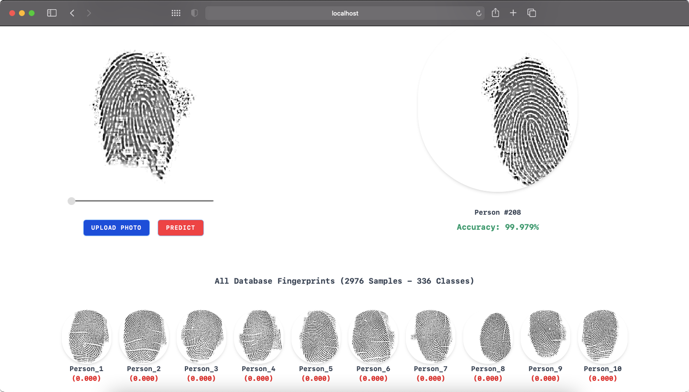
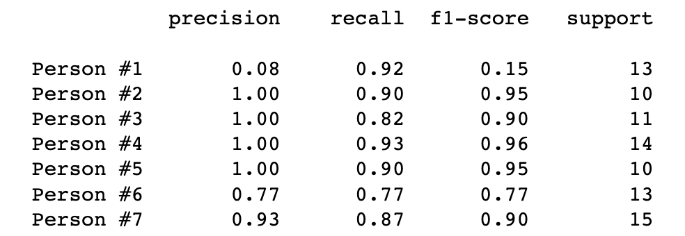

## Contact Fingerprint Recognition - Deep Learning 🖐

The fingerprint classification is conducted on PolyU's (Hong Kong Polytechnic University) research database with 336 individuals. Our approach introduces computer vision pre-processing methods to capture regions of interest in fingerprint images to allow effective feature extraction.

### Downloads - [Project Report](https://docs.google.com/document/d/1M8Uuayooe41rXfjOnnsMSI_earZXyu6RDQTVMWHmvVY/edit?usp=sharing) / [Slides](https://docs.google.com/presentation/d/17UGjXvcZBvHem8YrTKHmOrqw63oFVGT5tZNOA2pNzio/edit?usp=sharing)

### Objectives
- Design a Convolutional Neural Network (CNN) for feature extraction.
- Prepare dataset for pre-processing & model training.
- Tune model (fit) for multi-class classification prediction
- Evaluate model with the test samples (unknown samples)

### Website Demo

### About Project
- This was our final year ECE BTech project, which aims to investigate the performance of the state-of-the-art CNN-based Deep learning techniques as an alternative to the conventional minutiae-based fingerprint identification.
- Our proposed method achieved a classification accuracy of 94.26%.

### Team
- [@sid03](https://www.linkedin.com/in/sidheesh-nair-03859516a/)
- [Md. Salman Ali](https://www.linkedin.com/in/mohammedsalmanali/)
- [Sivaprasad PT](mailto:sivaprasadpt002@gmail.com)

### References
-  Chenhao Lin, Ajay Kumar, "Matching Contactless and Contact-based Conventional Fingerprint Images for Biometrics Identification," IEEE Transactions on Image Processing, vol. 27, pp. 2008-2021, April 2018.
